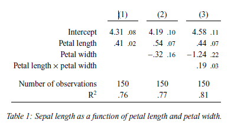

<style>
  <!--

  a, a[href^="https:"] {
    text-decoration: none;
  }
  body {
    font-family: Georgia, "Times New Roman", Times, serif;
    font-size: 1.05em;
    line-height: 1.7;
    margin-top: 9ex;
  }
  div.sourceCode {
    margin-top: -1ex;
    margin-bottom: 6ex;
    margin-left: 0;
    margin-right: 0
  }
  h1 {
    margin-top: 3ex;
    margin-bottom: 0.67ex;
  }
  h2 { 
    border-bottom: unset; 
    /* margin-block-end: unset; */
    margin-bottom: 0.1ex;
    padding-top: 2.75ex;
  }
  p {
    margin: unset;
    margin-bottom: 2ex;
    max-width: 60ch;
  }
  
  /* For images immediately preceded by code chunks */
  .sourceCode + p > img {  
    margin-top: -4ex;
    margin-bottom: 4ex;
  }
  
  .marginBottom1p5ex { margin-bottom:  1.5ex; }
  .marginBottom2ex   { margin-bottom:  2.0ex; }
  .marginBottom4ex   { margin-bottom:  4.0ex; }
  .marginTopN4p5ex   { margin-top:    -4.5ex; }

  /* Fix display of source code on small screens. See #25. */
  a.sourceLine { display: unset; }
  pre > code.sourceCode > span { display: unset;  }

  -->
</style>


```{r, include = FALSE}
knitr::opts_chunk$set(
  collapse = TRUE,
  comment = "#>"
)
```


The `Bullock` package provides three functions to help you make tables:
`regTable()`, `latexTable()`, and `latexTablePDF()`. The functions can be
used separately but are designed to be used together. `regTable()` generates a 
matrix of regression results, `latexTable()` turns it into LaTeX code, and 
`latexTablePDF()` renders the LaTeX code as&nbsp;PDF.

Many other packages will help you to make tables. The outstanding feature of
this package is that it offers you *less.* For example, this package offers
you no opportunity to change colors or fonts, to add rules and borders in
inappropriate places, or to create tables with baroque layouts. This package
makes easy things easy, and it makes creating bad tables quite difficult.

The other major feature of this package is that it makes tables easier to read
by prioritizing the careful use of white space between different table
elements. With that in mind, it produces "Tufte tables," in which standard
errors are printed to the right of their estimates and in smaller type.
Relative to conventional formatting---which places standard errors below the
estimates and in parentheses---the formatting used here makes it easier for
readers to instantly identify the information that they need. To my knowledge,
the table design used here was first used in Edward Tufte's essay on [The
Cognitive Style of PowerPoint](https://www.edwardtufte.com/tufte/powerpoint).


```{r setup, echo = FALSE}
library(Bullock)
```


## Quick start
Begin by generating a few regression objects and then putting the results into 
a matrix:
```{r quickstart-regtable, R.options = list(width = 200)}
data(iris)
lm1    <- lm(Sepal.Length ~ Petal.Length,               data = iris)
lm2    <- lm(Sepal.Length ~ Petal.Length + Petal.Width, data = iris)
lm3    <- lm(Sepal.Length ~ Petal.Length * Petal.Width, data = iris)
lmList <- list(lm1, lm2, lm3)
rT1    <- regTable(lmList)
rT1
```


Then use `latexTable()` convert the matrix into LaTeX code:
```{r quickstart-latexTable}
lT1 <- latexTable(
  mat      = rT1,
  rowNames = c("Intercept", "Petal length", "Petal width", "Petal length $\\times$ petal width"),
  colNames = lt_colNumbers(),
  caption  = '\\textit{Sepal length as a function of petal length and petal width.}'
)

head(lT1)

tail(lT1)
```


You see that `lT1` contains LaTeX code for a macro called `myTable`. You can 
render the table directly to a PDF file by calling `latexTablePDF()`:
```{r quickstart-latexTablePDF, eval = FALSE}
latexTablePDF(lT1, outputFilenameStem = 'irisTable')
```



Or you can write the macro to a .tex file:
```{r quickstart-latexTablePDF-tex, eval = FALSE}
latexTablePDF(lT1, outputFilenameStem = 'irisTable', writeTex = TRUE)
```

::: {.marginTopN4p5ex}
The .tex file can then be inserted into your master LaTeX document by adding 
`\input{irisTable.tex}` or `\include{irisTable.tex}` into your master LaTeX document.
(For more on `\input` and `\include`, see 
[the LaTeX wikibook](https://en.wikibooks.org/wiki/LaTeX/Modular_Documents)
and [Stack Overflow](https://tex.stackexchange.com/q/246).)
:::


<!--
Why does `latexTable()` produce a macro by default, rather than just producing 
LaTeX code for a table? The answer is that macros are easier to use than raw
table code. For example, if you wanted to insert a table in the middle
of a chapter, you would ordinarily need to insert all of the LaTeX code needed 
to create that table. The code might be hundreds of lines, and if you inserted
all of it into the middle of your chapter, it would be a great interruption,
making your chapter hard to read in your LaTeX editor. But when the table code
is encapsulated in a macro, you need only insert a single line---for example,
`\myTable{p}`---in the middle of your chapter. The macro definition itself,
which exists in "irisTable.tex", can be inserted at any other point in your
document.
-->


## Updating tables with `update()`
Suppose that you produce a complex table with a long `latexTable()` call. You 
then want to produce a new table that is similar. For example, you may want to
produce a new table with different data but all of the same design features 
(the same row names, the same spacing, etc.). You could issue another long
`latexTable()` call to produce the new table. Or you could just use `update()`:
```{r update}
lm1v <- update(lm1, subset = (Species == 'versicolor'))
lm2v <- update(lm2, subset = (Species == 'versicolor'))
lm3v <- update(lm3, subset = (Species == 'versicolor'))
rT2  <- regTable(list(lm1v, lm2v, lm3v))
lT2  <- update(lT1, mat = rT2)
lT2[23:26]  # just showing the data rows
```


## Tweaking tables
Instead of using `update()`, you may prefer to edit your table "by hand" after 
it is produced by `latexTable()`. This is easy to&nbsp;do, because
`latexTable()` returns an object of the "character" class---that is, a vector
of strings. Each string is a line of LaTeX code. The simple format of the
returned object makes it easy to edit the object before writing it to disk as
a .tex or PDF file:
```{r tweak-by-hand}
lT2[24:26]  

# Capitalize first letter of each word that is preceded by a space
lT2[24:26] <- gsub("([[:space:]])([[:alpha:]])", "\\1\\U\\2", lT2[24:26], perl=TRUE)
lT2[24:26]
```

::: {.marginTopN4p5ex .marginBottom4ex}
In practice, you will probably want to tweak tables only when you have unusual 
formatting requirements that cannot be satisfied by the `latexTable()` options.
:::

<!-- 
  In particular, the formatting of each column is specified with `numprint`
  codes, and these rules may need to be tweaked. For example, if your column
  names are long (and not split across multiple lines), you may want to modify
  the object that \code{latexTable} returns. Specifically, you may want to
  change \code{N{2}{2}} in the estimate-column specification to \code{N{3}{2}}
  or \code{N{4}{2}} to get the column pair centered beneath its heading. See the
  \href{http://mirrors.ctan.org/macros/latex/contrib/numprint/numprint.pdf}{documentation
  for the \code{numprint} LaTeX package} for more information on \code{numprint}
  column specifications like \code{N{2}{2}}.\cr\cr
-->


## Cutting and pasting with `headerFooter = FALSE`
You may not want to generate standalone .tex or PDF files. Instead, you may
already have the skeleton of a LaTeX table set up in your master LaTeX
document, and you may just want to copy the table rows (specified as LaTeX
code) from R into that skeleton table. This is easy to do with the
`headerFooter` argument to `latexTable()`:
```{r cutPaste}
latexTable(
  headerFooter  = FALSE,
  mat           = rT1,
  rowNames      = c("Intercept", "Petal length", "Petal width", "Petal length $\\times$ petal width"),
  spacerColumns = c(0, 2, 4)
)
```

<!--
# {#furtherBenefits}
## Further benefits of building tables with these tools
Some of the benefits are described at the start of this vignette. In addition:

* *Sane defaults.* `latexTable()` uses sane defaults for table formatting. That
is, it produces tables with (a)&nbsp;no vertical rules, (b)&nbsp;few horizontal
rules, and (c)&nbsp;sensible spacing between rows and columns. The result is
tables that are easier to read than normal tables: when looking at a table
created with `latexTable()`, you will not need to squint, or indeed to work
at all, to figure out whether a given number corresponds to this variable or
to that&nbsp;one.


* *Well-formatted LaTeX code.* `latexTable` produces well-formatted LaTeX
code. In other words, you won't just get tables that look good when they are
rendered (for example, as PDF). You'll also get LaTeX code that is easy to
read and to modify in the LaTeX editor of your choice.
-->


# {#technicalNote-columnSpacing}
## Technical note: column spacing in LaTeX
Ordinary methods for inserting space between columns in LaTeX involve the
`\tabcolsep` and `\extracolsep` LaTeX lengths.  Unfortunately, `\cmidrule` and
other commands in the `booktabs` package don't recognize that these LaTeX
lengths are spaces between columns. As a result, rules (horizontal lines)
drawn by `booktabs` commands extend into the intercolumn region if
`\tabcolsep` and `\extracolsep` are used to provide intercolumn space. A
similar problem occurs if `\hspace` is used to provide intercolumn space.

Thus, to fine-tune the spacing of the LaTeX tables produced by `latexTable()`,
blank columns can be inserted at arbitrary positions via the `spacerColumns`
argument. This is not the simplest way to adjust intercolumn space, but it
solves the problem of positioning horizontal rules. In addition, no other
approach gives you the freedom to insert horizontal space at arbitrary
positions (useful for distinguishing tiers of columns from each other), and no
other approach allows variation in the widths of the spaces between columns.

<br><br>

